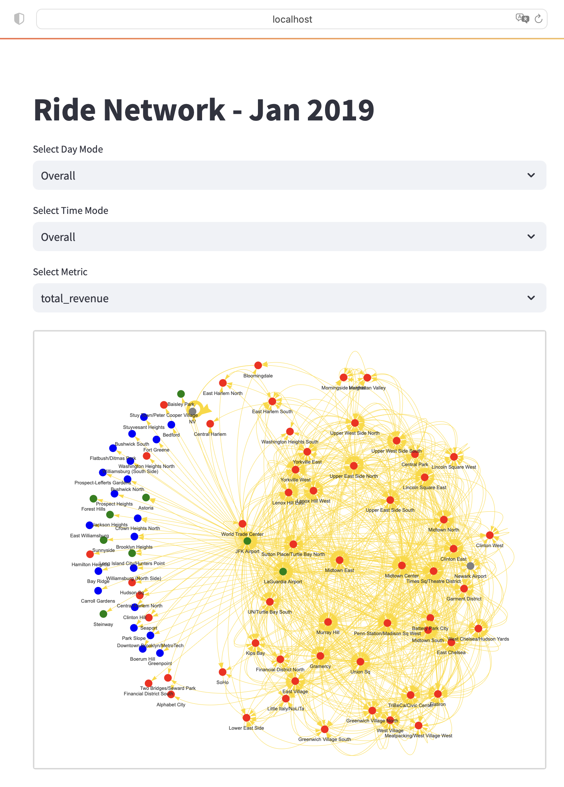

# RideNetwork: Exploring the journey of ride-hailing across New York City

In this project, the main goal is to derive analysis from taxi trips that happened on January 2019 at New York, which may be useful for business stakeholders for their planning.

## High Level Overview

Some insights that can be derived from **January 2019** report:
- JFK Airport managed to attract customers that generated over $10,000,000 
- The taxi are mostly used for rush hour (coming and leaving office) and slightly on the midnight of weekend
- Manhattan was a favourite place for destination regardless of whether it's weekday or weekend
- Based on the number of passengers served, there are several potential zones which requires more taxi cars availability during weekdays, especially at the Manhattan Borough (Upper East Side South, Upper East Side North, and Midtown Center)

## Network Analysis

For this project, nodes represent a district and several types of edges are used as follows:
- total_revenue
- total_trips
- total_passengers_served
- total_distance_travelled
- total_time

Each node will be assigned with a color based on their borough, as follows:

| Borough | Color |
|----------|----------|
| Manhattan | Red  |
| Brooklyn  | Blue  |
| Queens  | Green  |
| Bronx  | Orange  |
| Staten Island  | Purple  |
| Unknown  | Gray  |

Regarding the visualization, only the top 1000 edges with the highest weight value will be displayed, as this will help to derive better insights compared to showing all available edges.

### Overall Total Trips

Overall, it is observed that majority of the riding activities happened within the Manhattan borough. 

There were less activities that happened on districts outside the Manhattan region, except for airports like JFK and LaGuardia.

One last interesting insight is that there was also a lot of taxi activities that happen within the NV district (Unknown Borough).

### Overall Total Revenue

The explanation is similar to the overall total trips

### Weekday Morning Total Revenue

While all the insights from the overall analysis is still true, there was huge revenue generation that happened on trips from Bloomingdale to NV (Unknown Borough).

## Web Application for Network Analysis

This project provides a code for building a Streamlit application which can help you to draw a graph network using 3 filters:

- Day Mode: 
    - Overall
    - Weekday
    - Weekend

- Time Mode: 
    - Overall
    - Dawn (12AM - 5AM)
    - Morning (6AM - 11AM)
    - Afternoon (12PM - 5PM)
    - Night (6PM - 11PM)

- Metric:
    - total_revenue
    - total_trips
    - total_passengers_served
    - total_distance_travelled
    - total_time

## Next Step

Check whether NV represent Newark Airport, or if there are out-of-town districts that are misclassified as NV.

## Credit

Thanks to Sripathi Mohanasundaram (@microize) for sharing the dataset at Kaggle for usage.

Dataset Link: https://www.kaggle.com/datasets/microize/newyork-yellow-taxi-trip-data-2020-2019?select=taxi%2B_zone_lookup.csv